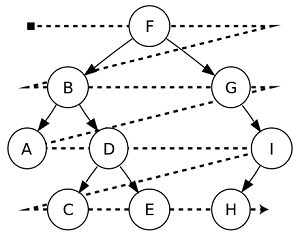
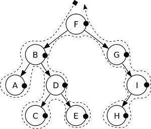

# 29\. - Abstraktní datové typy

> Abstraktní datové typy, seznam, fronta, zásobník, halda, strom, asociativní pole.

**Abstraktní datové typy (ADT)**

- matematický model nezávislý na konkrétní implementaci v programovacím jazyce
- popisuje chování (možné operace) z hlediska uživatele dat
- často se u nich uvádí časová či paměťová složitost (důležité z hlediska efektivního návrhu různých algoritmů)
- uživatel používá pouze obecné rozhraní ADT a konkrétní implementace mu zůstává skryta
- ADT může mít více různých implementací, např. seznam lze implementovat jako dynamické pole nebo jako spojový seznam, integer lze například implementovat jako biární v jedničkovém nebo dvojkovém doplňku
- jazyky mají ve svých standartních knihovnách obvykle obsaženy optimalizované implementace různých ADT
-  [Wikipedia](https://en.wikipedia.org/wiki/Abstract_data_type)

**Datové struktury**

- narozdíl od ADT se jedná o konkrétní organizaci dat v paměti
- definuje je ten, kdo je implementuje
- například binární haldu lze uložit do pole

## Vlastnosti

Nejdůležitější vlastnosti abstraktního typu dat jsou:

- **Univerzálnost:** - navržený ADT je univerzální a může být použit v libovolném programu (jako hodnota libovolný datový typ)
- **Zapouzdření:** - vnitřní reprezentace je skryta za transparetní rozhraní, které je poskytováno uživateli (uživatel ví jak použít, ne jak je implementováno)
- **Integrita:** - do vnitřní struktury nelze zasahovat jinak, než přes definované rozhraní (zamezuje nechtěnému poškození dat)
- **Modularita:** - konkrétní implementaci implementaci na spodu je možné libovolně měnit (vylepšovat), aniž by bylo nutné přepisovat programy, které ADT využívají (abstrakce modelu od konkrétní implementace)

Pokud je ADT programován objektově, jsou většinou tyto vlastnosti splněny.

## Základní operace

Na abstraktním datovém typu rozlišujeme tři druhy základních operací:

- **konstruktor** zodpovídá za správnou inicializaci a sestavené platné reprezentace datového typu na základě dodaných parametrů
- **selektor** slouží k získání hodnot (get, empty, peek)
- **modifikátor** provádí změnu hodnoty (add, remove, pop)

## Příklady

K základním abstraktním datovým typům můžeme zařadit následující konstrukce:

- **zásobník** (stack)
- **fronta** (queue)
- **seznam** (list)
- **množina** (set)
- **strom** (tree) - speciálním typem stromu je **halda** (heap)
- **zobrazení** (map) - také známé jako **asociativní pole** (hash)

### Seznam

- kontejner pro ukládání dat předem neznámé délky
- nerozdíl od množiny (set) se mohou stejné prvky opakovat

Typické operace:

- **add**: vložení hodnoty na konec seznamu
- **remove**: odstranění hodnoty z určitého indexu (prvky za se přisunou)
- **get**: čtení hodnoty z určitého indexu
- **empty**: testování, zda je seznam prázdný
- **size**: dotaz na velikost seznamu

Implementace je obvykle realizována jako:

- **Dynamické pole**

  - postaveno na statickém poli pevné velikosti
  - při vkládání kontrolujeme velikost a vnitřního pole a případně ho zvětšíme
  - v kontruktoru obvykle předáváme počáteční velikost vnitřního pole
  - díky vnitřnímu poli umožňuje rychlejší vyhledávání prvku dle indexu (je možné realizovat binární vyhledávání)
  - [Wikipedia](https://en.wikipedia.org/wiki/Array_data_structure)
- **Spojových seznam**

  - jednotlivé prvky jsou reprezentovány vždy jako uzly, které mají odkaz na svého následníka (případně i předchůdce)
  - uzly je nutné při vyhledávání procházet postupně (pouze lineární vyhledávání)
  - [Wikipedia](https://en.wikipedia.org/wiki/Linked_list)

Spojové seznamy (linked list) mohou existovat **jednosměrné** a **obousměrné**.V jednosměrném seznamu odkazuje každá položka na položku následující a v obousměrném seznamu odkazuje položka na následující i předcházející položky. Zavádí se také ukazatel nebo reference na aktuální (vybraný) prvek seznamu. Na konci (a začátku) seznamu musí být definována zarážka označující konec seznamu.Pokud vytvoříme cyklus tak, že konec seznamu navážeme na jeho počátek, jedná se o **kruhový seznam**. Viz následující ukázky.

### Fronta

- prvek, který byl nejdříve přidán, bude také nejdříve odebrán
- anglické označení First In First Out (FIFO)
- implementace pomocí spojových seznamů (výhodný je obousměrný) nebo pole
- využití:

  - plánování procesů v OS (FCFS)
  - meziprocesová komunikace - roura (pipe)
  - síťová komunikace - buffer pro datové pakety (switch, bridge, router)
- [Wikipedia](https://en.wikipedia.org/wiki/Queue_(abstract_data_type))

Typické operace:

- **enqueue**: vložení hodnoty na konec fronty
- **dequeue**: odstranění hodnoty ze začátku fronty
- **front**: čtení hodnoty na začátku fronty
- **empty**: testování, zda je fronta prázdná
- **size**: dotaz na velikost fronty

### Zásobník

- prvek, který byl naposled přidán bude nejdříve odebrán
- anglické označení Last In First Out (LIFO)
- implementace pomocí pole nebo spojových seznamů
- [Wikipedia](https://en.wikipedia.org/wiki/Stack_(abstract_data_type))

Typické operace:

- **push**: vložení hodnoty na vrchol zásobníku,
- **pop**: odstranění hodnoty z vrcholu zásobníku
- **top**: čtení hodnoty z vrcholu zásobníku
- **empty**: testování, zda je zásobník prázdný
- **size**: dotaz na velikost zásobníku

### Strom

- hierarchická struktura
- každý uzel může mít několik potomků (přímých potomků)
- všechny uzly kromě kořenového uzlu mají právě jednoho rodiče
- uzel, který nemá žádné potomky (je koncový) se nazývá _list_
- vlastnost býti stromem je rekurzivní, každý podstrom je také strom
- [Wikipedia](https://en.wikipedia.org/wiki/Tree_(data_structure))
- použití:

  - halda
  - vyhledávací strom

**Vlastnosti:**

- **N-arita** - Kolik smí mít každý uzel maximálně potomků, z tohoto hlediska patří mezi neoblíbenější binární stromy (každý uzel má 0, 1 nebo 2 potomky).
- **Hloubka uzlu** - Hloubka uzlu je délka cesty od kořene k uzlu
- **Výška stromu** - Je rovna hodnotě maximální hloubky stromu.
- **Šířka stromu** - Maximální počet uzlů na stejné úrovni.
- **Vyváženost** - Strom je vyvážený, jestliže má uzly rovnoměrně rozložené tak, že má nejmenší možnou výšku.
    - Nebo ekvivaletně: Strom je vyvážený, jestliže pro každý vrchol stromu platí, že počet vrcholů v leveém a pravém podstromu se liší nejvýše o 1.

**Procházení stromem:**

1. **Průchod do šířky**

  Projdou se nejprve všechny uzly stromu v jedné hloubce a až poté se pokračuje do další hladiny, kde se opět projdou všechny uzly v dané hloubce.
 
 
  Příklad: F, B, G, A, D, I, C, E, H

2. **Průchod do hloubky**

  Procházení začíná v kořeni stromu a postupuje se po potomcích uzlu. Procházení končí, když už v žádné větvi není nenavštívený potomek.

  Při průchodu je možné zpracovat navštívený uzel (N), projít levý podstrom (L) a projít pravý podstrom (P). Podle pořadí těchto akcí se rozlišují tři druhy průchodu:

  - **Preorder** (NLR): F, B, A, D, C, E, G, I, H
  1. Check if the current node is empty or null.
  2. Display the data part of the root (or current node).
  3. Traverse the left subtree by recursively calling the pre-order function.
  4. Traverse the right subtree by recursively calling the pre-order function.

  
  
  - **Inorder** (LNR): A, B, C, D, E, F, G, H, I
  1. Check if the current node is empty or null.
  2. Traverse the left subtree by recursively calling the in-order function.
  3. Display the data part of the root (or current node).
  4. Traverse the right subtree by recursively calling the in-order function.
  
  
  
  - **Postorder** (LRN): A, C, E, D, B, H, I, G, F
  1. Check if the current node is empty or null.
  2. Traverse the left subtree by recursively calling the post-order function.
  3. Traverse the right subtree by recursively calling the post-order function.
  4. Display the data part of the root (or current node).
  
  
  
**Realizace:**
- Binární strom lze reprezentovat do pole (pro prvek n indexováný od nuly):

  - 2n+1 hodnota pro levý podstrom
  - 2n+2 hodnota pro pravý podstrom
  

- Obecný strom lze realizovat ukazateli
  - ukazatel na rodiče
  - ukazatele na potomky

#### Halda

- stromová struktura splňující vlastnost haldy, tj. pokud  je potomek , tak

  -  pro _min heap_ nebo
  -  pro _max heap_

- vlastnost býti haldou je rekurzivní, všechny podstromy haldy jsou také haldy

- tvar stromu je buď perfektně vyvážený, nebo pokud je poslední úroveň stromu nekompletní, uzly plní strom zleva doprava
- efektivita operací haldy je klíčová pro mnoho algoritmů
- často se používá pro implementaci prioritní fronty (na tomto principu funguje heapsort)

**Binární halda**
- Strom je buď vyvážený, nebo se poslední úroveň stromu zaplňuje zleva doprava.
- Children of the node at position n would be at positions 2n and 2n + 1 in a one-based array, or 2n + 1 and 2n + 2 in a zero-based array

_Binární minimální halda_

_Příklad_

Operace s haldou:

Operace                 | Složitost                                                                                          | Popis
----------------------- | -------------------------------------------------------------------------------------------------- | -------------------------------------------------------------------------------------
INSERT                  |  | přidání nového prvku do haldy
DELETE MAX / DELETE MIN |  | vyjmutí kořenu v max heap nebo v min heap
DELETE(v)               |  | smaže uzel „v"
MIN, MAX                |                    | vrátí minimální resp. maximální klíč v haldě
DECREASE KEY(v, okolik) |  | zmenšení klíče uzlu „v" o hodnotu „okolik"
INCRESE KEY(v, okolik)  |  | zvětšení klíče uzlu „v" o hodnotu „okolik"
MERGE                   |                    | spojení dvou hald do jedné nové validní haldy obsahující všechny prvky obou původních
MAKE                    |                    | dostane pole N prvku a vytvoří z nich haldu

### Map (Zobrazení / Asociativní pole)

- prvkům z množiny klíčů přiřazuje nejvýše jednu hodnotu (klíč => hodnota)
- různá označení (Hash, HashMap, HashTable, AsociativeArray, Dictionary)

  - mapa (Java, C++)
  - slovník (.NET, Python)
  - object (Javascript)
  - asociativní pole (PHP)

- v porovnání s obecným polem může být klíčem i nečíselný typ (datový typ klíče musí pouze implementovat operaci porovnání)

- rychlé hledání podle klíče 
- nelze prohledávat podle částečného klíče
- z klíče nelze přímo spočítat umístění prvku v poli - používá se _hashovací funkce_
- [Wikipedia](https://en.wikipedia.org/wiki/Associative_array)

